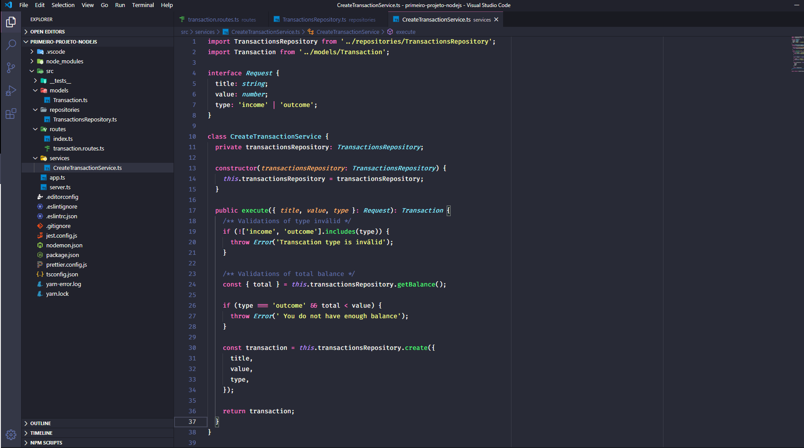

<h3 align="center">
  Desafio 05: Primeiro projeto Node.js
</h3>

  <a href="#rocket-sobre-o-desafio">About the challenge</a>&nbsp;&nbsp;&nbsp;|&nbsp;&nbsp;&nbsp;

## :rocket: About the challenge

In this challenge, we created an application to continue training what we have learned so far in Node.js together with TypeScript, using the concept of models, repositories and services!

This will be an application where we will store incoming and outgoing financial transactions, and it should also allow the registration and listing of these transactions.

  

Made by Janderson Pizzially Vilas Boas (https://www.linkedin.com/in/jandersonvilasboas/)
